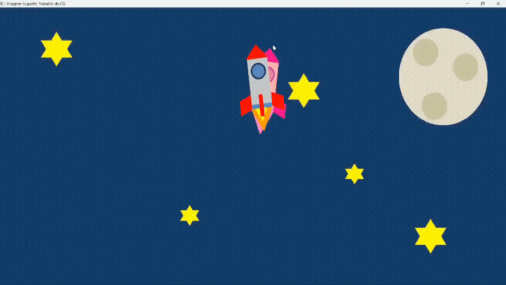

# Rocket Animation with OpenGL

[](https://github.com/victor-kauan-coder)
[](https://www.linkedin.com/in/victor-miranda-5342a6337)

A Computer Graphics project written in **C++** that renders a 2D scene with two animated rockets following a **heart-shaped trajectory** against a space-themed background.



## About the Project

This project was developed for a **Computer Graphics course** and demonstrates fundamental concepts of **2D rendering** and **animation** using the **OpenGL Utility Toolkit (GLUT)**.

The scene is composed of:

- Static elements: stars and a cratered moon.
- Dynamic elements: two rockets moving autonomously.

The highlight of the animation is the rockets’ trajectory, computed in real-time with the **parametric equation of a heart curve**.  
Each rocket’s orientation dynamically follows the **tangent of the curve**, creating a more realistic motion effect.

---

## Features

- 2D animation with two rockets moving independently.
- Parametric trajectory based on the heart curve equation.
- Dynamic orientation: rockets rotate to align with their direction of travel.
- Visual trail showing the path of the rockets.
- Scene elements: stars, moon, and rockets drawn using OpenGL primitives.
- Object-oriented code structure (Rocket, Star, Moon).
- Cross-platform: works on Windows, macOS, and Linux.

---

## Technologies Used

- **Language:** C++
- **Graphics API:** OpenGL
- **Library:** GLUT (OpenGL Utility Toolkit)

---

## Getting Started

### Prerequisites

1. **C++ Compiler**

   - Windows: [MinGW-w64](http://mingw-w64.org/)
   - macOS: Xcode Command Line Tools
   - Linux (Debian/Ubuntu):
     ```bash
     sudo apt-get install build-essential
     ```

2. **GLUT Library**
   - Windows: recommended to install **freeglut** (place `.h`, `.lib`, and `.dll` in the appropriate MinGW folders).
   - macOS: already included with Xcode.
   - Linux (Debian/Ubuntu):
     ```bash
     sudo apt-get install freeglut3-dev
     ```

---

### Compilation and Execution

Open a terminal in the project’s root folder and run:

- **Linux/macOS:**

  ```bash
  g++ main.cpp -o rocket -lGL -lGLU -lglut
  ./rocket
  ```

- **Windows(MinGW):**
  ```bash
  g++ main.cpp -o rocket -lfreeglut -lopengl32 -lglu32
  rocket.exe
  ```
